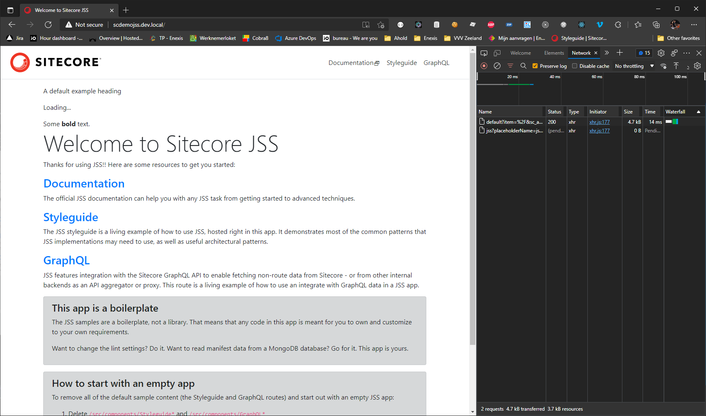
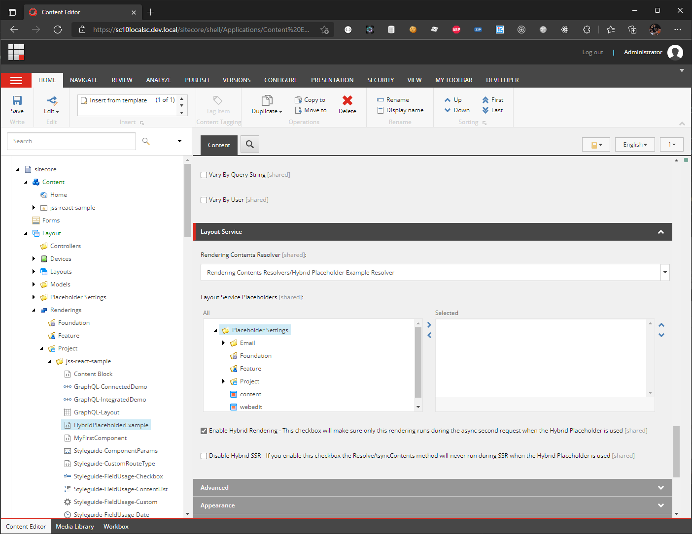
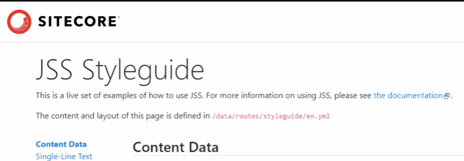

# Hybrid Placeholder

With the Hybrid Placeholder it's possible to load heavy parts of a Rendering Contents Resolver later. When a user navigates to a page directly everything will be loaded (with SSR support). When a user navigates to a page using Client-Side Rendering with XHR (single page app) the data is fetched with the layout service. Than the heavy parts can be skipped and will be loaded once the page is already visible. 

## Installing
You can watch a getting started video here: https://youtu.be/-8k7jzuRk9U

<a href="https://youtu.be/-8k7jzuRk9U" target="_blank"></a>

You can follow these steps to only install the Hybrid Placeholder:
1. Install [Hybrid Placeholder-1.0.zip](./SitecorePackages/Hybrid%20Placeholder-1.0.zip) in your Sitecore solution. Tested on Sitecore 10.1 and 10.2.
2. Run ```npm i hybrid-placeholder@19.0.2``` in your React app. Make sure the version matches the [@sitecore-jss/sitecore-jss-react](https://www.npmjs.com/package/@sitecore-jss/sitecore-jss-react) version you're using.
3. Follow the [Using the Hybrid Placholder](#using-the-hybrid-placeholder) section below.

There is an example package which can be added:

1. Install [Hybrid Placeholder example-1.0.zip](./SitecorePackages/Hybrid%20Placeholder%20example-1.0.zip) in your Sitecore solution.
2. Run ```npm i hybrid-placeholder-example@19.0.2``` in your React app.
3. Create a React component which exports the HybridPlaceholderExample component.
4. Deploy the jss app.
5. In Sitecore add the component to the placeholder settings.
6. Create a new component which uses the HybridPlaceholderExample rendering.

## Using the Hybrid Placeholder
1. Make sure the component is added to ```<HybridPlaceholder name="" rendering={rendering} config={config} />``` instead of ```<Placeholder name="" rendering={rendering} />```.
2. Let the Rendering Contents Resolver inherit from HybridRenderingContentsResolver. You can build your model in ResolveDefaultContents and ResolveAsyncContents. During SSR both will be called. When using using Client-Side Rendering with XHR first only ResolveDefaultContents is executed and ResolveAsyncContents will be executed async in a second request. So both only run once. The Hybrid Placeholder will get the JSON from the first and second request and merge them. Only null values from the first request will be overriden with values from the second request.

You can build your model in ResolveDefaultContents. In ResolveAsyncContents you can add the heavy code.
Here is an example which shows a date after 2 seconds:
```cs 
public class HybridPlaceholderExampleContentsResolver : HybridRenderingContentsResolver<HybridExample, object>
{
    public HybridPlaceholderExampleContentsResolver(IRouteMapper routeMapper) : base(routeMapper)
    {
    }

    protected override (HybridExample content, object renderingParameters) ResolveDefaultContents(
        Rendering rendering,
        IRenderingConfiguration renderingConfig)
    {
        var datasource = !string.IsNullOrEmpty(rendering.DataSource)
            ? rendering.RenderingItem?.Database.GetItem(rendering.DataSource)
            : null;

        var hybridExample = new HybridExample
        {
            Heading = datasource?["Heading"],
            Text = datasource?["Text"]
        };

        return (hybridExample, null);
    }

    protected override (HybridExample content, object renderingParameters) ResolveAsyncContents(
        HybridExample content,
        object renderingParameters, Rendering rendering, IRenderingConfiguration renderingConfig)
    {
        var hybridExample = content ?? new HybridExample();
        Thread.Sleep(2000);
        hybridExample.Date = DateTime.Now.ToString("f");

        return (hybridExample, null);
    }
}
```

This is the ResolveContents method in HybridRenderingContentsResolver:
```cs
public object ResolveContents(Rendering rendering, IRenderingConfiguration renderingConfig)
{
    var disableHybridSsrRenderingField = rendering.RenderingItem?.InnerItem?.Fields["Disable Hybrid SSR"];
    var disableHybridSsr = disableHybridSsrRenderingField != null && disableHybridSsrRenderingField.Value == "1" && !Sitecore.Context.PageMode.IsExperienceEditor;
    
    // Store the data the Hybrid Placeholder needs in the frontend.
    this.contextWrapper.SetHybridPlaceholderData(rendering.UniqueId, rendering.Placeholder, !disableHybridSsr);
    
    var content = default(TContent);
    var renderingParameters = default(TRenderingParameters);
    
    if (!this.contextWrapper.IsLayoutServiceRoute || !this.contextWrapper.IsHybridPlaceholder)
    {
        // Only runs once. If it's SSR or when it's not called from the Hybrid Placeholder.
        (content, renderingParameters) = ResolveDefaultContents(rendering, renderingConfig);
    }
    if ((!this.contextWrapper.IsLayoutServiceRoute && !disableHybridSsr) || this.contextWrapper.IsHybridPlaceholder)
    {
        // Only runs once. If it's SSR or when the Hybrid Placeholder fetches the async data.
        (content, renderingParameters) = ResolveAsyncContents(content, renderingParameters, rendering, renderingConfig);
    }
    
    return JToken.FromObject(content, new JsonSerializer
    {
        ContractResolver = new CamelCasePropertyNamesContractResolver()
    });
}
```
The ```IsLayoutServiceRoute``` check is for SSR support. 
The ```IsHybridPlaceholder``` check means the page is already loaded and the heavy part can be executed.
The ```disableHybridSsr``` check means this method should not run during SSR.

3. In Sitecore check the Enable Hybrid Rendering checkbox. It will make sure only this rendering runs during the async second request. You can also check the Disable Hybrid SSR checkbox. If you enable this checkbox the ResolveAsyncContents method will never run during SSR when the Hybrid Placeholder is used.


4. In the React component add the ```isLoaded``` prop. 
```js
const HybridPlaceholderExample = ({ fields }) => {
    let {
        heading,
        date,
        text,
        isLoaded,
    } = fields;
    isLoaded = isLoaded ?? true;
    return (
        <div>
            <p>{heading}</p>
            {isLoaded && (
                <p>{date}</p>
            )}
            {!isLoaded && (
                <p>Loading...</p>
            )}
            <div dangerouslySetInnerHTML={{__html: text}} />
        </div>
    )};

export default HybridPlaceholderExample;
```
And that's it. Based on ```isLoaded``` we can show all data on the page and a loader while not everything is loaded yet. You no longer need a separate Web API to load heavy parts of a website.

It will look like this:


The Hybrid Placeholder has been developed at [iO](https://www.iodigital.com/) and is used at the [Enexis](https://www.enexis.nl/) website.